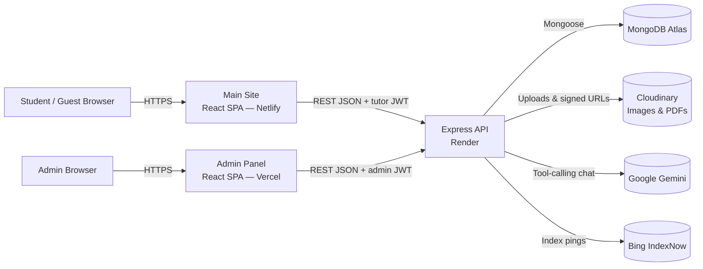

# TutionMaster

TutionMaster is a tutoring marketplace platform built for Nepal that connects students with qualified private tutors. Tutors register an account, build a detailed public profile (qualifications, subjects, availability, hourly rate, CV), and students can browse, filter, or ask an AI assistant to find a tutor — all without needing to create an account of their own. A separate internal admin panel handles tutor verification, profile visibility, and review moderation.

The project is three independent applications sharing one backend:

| App | Path | Audience |
| --- | --- | --- |
| Main site | `frontend/` | Students & tutors |
| Admin panel | `admin-panel-client/` | Platform staff |
| API server | `backend/` (includes `backend/admin-panel-server/`) | Both of the above |

## ✨ Features

### For Tutors
- **Account registration & login** with JWT-based auth, plus **Google Sign-In**
- **Profile creation & management** via a 4-step wizard — qualifications, address, preferred subjects, bio, experience, hourly rate, and weekly availability
- **Avatar upload** — resized, converted to WebP, auto-quality, hosted on Cloudinary
- **CV upload & viewing** — PDFs are compressed (`pdf-lib`) before upload and rendered in-app with a zoomable, paginated, fullscreen-capable viewer
- **Dashboard** with profile stats and quick actions
- **AI profile-completeness feedback** — the AI assistant can score and critique a logged-in tutor's own profile
- **Ownership enforcement** — only the tutor who owns a profile can update, delete, or replace its files
- Profiles require **admin approval (`isVisible`)** before they appear in the public directory

### For Students / Visitors
- **Public tutor directory** with server-side pagination
- **Filtering** by subject(s), city, teaching mode (Online / In-person / Both), experience range, and hourly rate range
- **Free-text search** across tutor name, bio, and city
- **AI chat assistant** (floating widget on every page) — describe what you need in plain language and it searches tutors, shows similar matches, and can post a "requirement" if nothing fits
- **Ratings & reviews** — leave a star rating + written review as a guest (one per email per tutor); reviews are moderated before appearing publicly
- **Tutor detail pages** with full profile, CV preview, and a "TuitionMaster Verified" badge for approved tutors

### Admin Panel
- Separate login and JWT (own secret, own token shape) from the tutor/student side
- **Dashboard** — teacher/admin counts (total, visible, hidden, active, pending, recently added)
- **Teacher moderation** — list/search all profiles (including hidden ones) and toggle public visibility
- **Review moderation** — approve, hide, or delete submitted reviews
- **Administrator management** (Super Admin only) — create, deactivate, or remove other admin accounts; the seeded Super Admin account is protected from deactivation/deletion

### Platform-wide
- **Newsletter subscription** with duplicate-email detection
- **SEO** — per-tutor meta tags, Open Graph/Twitter cards, JSON-LD structured data, an XML sitemap, and IndexNow pings on profile create/update/delete so search engines pick up changes fast
- **Analytics events** — AI searches, tutor recommendations, profile views, shortlists, requirement posts, and contacts are recorded for the admin dashboard/AI insight tools
- **Responsive UI** built with Tailwind CSS
- **Centralized error handling** with consistent JSON error responses
- **Rate limiting** — separate limiters for general traffic, auth endpoints, and AI chat

## 🛠️ Tech Stack

### Frontend (`frontend/`)

| Technology | Purpose |
| --- | --- |
| React 18 | UI library |
| React Router DOM 6 | Client-side routing |
| Axios | HTTP client, with auth-token and 401-redirect interceptors |
| React Hook Form | Form state and validation |
| React PDF | In-browser CV/PDF rendering |
| @react-oauth/google | Google Sign-In |
| react-ga4 | Google Analytics page-view tracking |
| react-helmet-async | Per-page SEO meta tags |
| Tailwind CSS | Utility-first styling |
| Lucide React | Icon set |
| React Toastify | Toast notifications |

### Admin Panel Client (`admin-panel-client/`)

| Technology | Purpose |
| --- | --- |
| React 18 | UI library |
| Vite 5 | Dev server & build tool |
| React Router DOM 6 | Client-side routing |
| Axios | HTTP client, admin-token interceptor |
| React Hot Toast | Toast notifications |
| Tailwind CSS | Utility-first styling |

### Backend (`backend/`, including `backend/admin-panel-server/`)

| Technology | Purpose |
| --- | --- |
| Node.js / Express 4 | HTTP server and routing |
| MongoDB / Mongoose 7 | Database and ODM |
| JSON Web Tokens (jsonwebtoken) | Stateless auth — separate secrets for tutor/user and admin tokens |
| bcryptjs | Password hashing |
| @google/genai | Google Gemini SDK — powers the AI chat assistant |
| google-auth-library | Verifies Google Sign-In ID tokens |
| Cloudinary | Image and document (PDF) hosting |
| express-fileupload | Multipart file parsing for uploads |
| pdf-lib | CV compression before upload |
| express-validator | Request body validation |
| Helmet, HPP, express-mongo-sanitize | Security headers, HTTP parameter pollution and NoSQL-injection protection |
| express-rate-limit | Global, auth, and AI-specific rate limiting |
| swagger-jsdoc / swagger-ui-express | Auto-generated API docs from route JSDoc, served at `/api/docs` |
| Winston + Morgan | Structured logging and HTTP request logging |
| Jest, Supertest, mongodb-memory-server | Test suite — real (in-memory) MongoDB, no mocking |
| PM2 | Production process management (clustering, restarts) |

### Deployment

| Technology | Purpose |
| --- | --- |
| Netlify | Main frontend static hosting (`netlify.toml`) |
| Vercel | Admin panel static hosting (`admin-panel-client/vercel.json`) |
| Render | Backend web service hosting (`render.yaml`) |
| MongoDB Atlas | Managed database for production |
| Docker / Docker Compose | Local orchestration — MongoDB + backend + main frontend (admin panel runs separately) |

## 🏗️ Project Architecture



The two frontends are single-page React apps that talk to one Express backend exclusively over a JSON REST API — the main site authenticates with a tutor/user JWT, the admin panel with a separately-secreted admin JWT. The backend persists all data in MongoDB, offloads image/CV storage to Cloudinary, and — when a Gemini API key is configured — runs an AI agent that calls internal "tools" (search tutors, fetch a profile, post a requirement, pull marketplace analytics, etc.) to answer chat messages with live data rather than fabricated answers.

## 📁 Project Structure

```text
tutionmaster/
├── backend/
│   ├── admin-panel-server/     # Separate admin API, mounted under /api/admin
│   │   ├── controllers/        # Admin auth, teachers, administrators, dashboard
│   │   ├── middleware/         # protectAdmin / requireSuperAdmin (own JWT secret)
│   │   ├── models/             # Admin
│   │   ├── routes/             # adminAuthRoutes, adminTeacherRoutes, administratorRoutes, dashboardRoutes, adminReviewRoutes
│   │   └── scripts/            # seedSuperAdmin.js — one-time Super Admin bootstrap
│   ├── config/                 # database.js, cloudinary.js, swagger.js, aiConfig.js
│   ├── controllers/            # auth, teachers, upload, newsletter, reviews, sitemap, ai
│   ├── middleware/              # auth (protect/optionalAuth/authorize), error, rateLimiter, validation, asyncHandler
│   ├── models/                 # User, Teacher, Review, Newsletter, AnalyticsEvent, Requirement
│   ├── routes/                  # Express routers, mounted under /api and /api/v1
│   ├── services/
│   │   ├── ai/                  # Gemini-backed chat agent
│   │   │   ├── agent.js         # Tool-calling loop
│   │   │   ├── providers/       # AIProvider base + geminiProvider implementation
│   │   │   ├── tools/           # teacherTools, userTools, insightTools, knowledgeTools
│   │   │   └── systemPrompt.js
│   │   └── newsletterService.js
│   ├── scripts/                 # createAdmin.js — promote a User to role:'admin'
│   ├── tests/                    # Jest + Supertest suite (real in-memory MongoDB)
│   ├── utils/                    # logger, errorResponse, validateEnv, withRetry, cache, indexNow, cloudinaryUtils, escapeRegex
│   ├── ecosystem.config.js       # PM2 configuration for production
│   ├── app.js                    # Express app wiring (no listen/DB connect — used by tests)
│   └── server.js                 # Application entry point
│
├── frontend/                     # Main public-facing app
│   ├── public/                   # Static HTML shell, robots.txt, llms.txt
│   ├── src/
│   │   ├── analytics/            # Google Analytics (react-ga4) wiring
│   │   ├── components/           # UI grouped by feature: teachers/, ai/ (ChatWidget), auth/, seo/, common/, steps/ (profile wizard)
│   │   ├── context/               # AuthContext, TeacherContext
│   │   ├── hooks/                  # useCvViewer, useTeacherForm, etc.
│   │   ├── pages/                   # Route-level page components
│   │   ├── services/                 # Axios-based API clients (auth, teacher, upload, review, ai, newsletter)
│   │   ├── utils/seo/                 # keepBackendAlive, teacherCache
│   │   ├── constants/                  # Static data (e.g. Nepal states/cities)
│   │   └── App.js                      # Route definitions
│   └── package.json
│
├── admin-panel-client/            # Internal admin app (Vite)
│   ├── src/
│   │   ├── components/layout/      # AdminLayout, Sidebar, SuperAdminRoute
│   │   ├── context/                 # AuthContext (admin)
│   │   ├── pages/                    # LoginPage, DashboardPage, TeachersPage, TeacherDetailPage, ReviewsPage, AdministratorsPage
│   │   ├── services/                  # api.js, adminServices.js, adminReviewService.js
│   │   └── App.jsx
│   └── package.json
│
├── docker-compose.yml              # Local orchestration: MongoDB + backend + main frontend
├── netlify.toml                    # Netlify build configuration (main frontend)
├── render.yaml                     # Render Blueprint (backend)
└── README.md
```

## 🚀 Getting Started

### Prerequisites

- **Node.js** v20 or higher and **npm**
- A **MongoDB** instance — local, a container, or a free [MongoDB Atlas](https://www.mongodb.com/atlas) cluster
- A **Cloudinary** account (for avatar and CV uploads)
- Optional: a **Gemini API key** ([free tier](https://aistudio.google.com/apikey)) to enable the AI chat assistant — without it, `/api/ai/chat` replies with a friendly "not configured" message instead of erroring
- Optional: a **Google OAuth client ID** to enable Google Sign-In
- **Docker & Docker Compose** (optional, for the containerized backend + main frontend + MongoDB)

### Installation

```bash
git clone https://github.com/AayushSinghRajput/tutionmaster.git
cd tutionmaster

# Backend
cd backend && npm install

# Main frontend
cd ../frontend && npm install

# Admin panel (only if you need it)
cd ../admin-panel-client && npm install
```

### Environment Variables

Create `backend/.env` (see `backend/.env.example`):

| Variable | Required | Description |
| --- | --- | --- |
| `MONGODB_URI` | Yes | MongoDB connection string |
| `JWT_SECRET` | Yes | Secret used to sign tutor/user JWTs |
| `CLOUDINARY_CLOUD_NAME` | Yes | Cloudinary cloud name |
| `CLOUDINARY_API_KEY` | Yes | Cloudinary API key |
| `CLOUDINARY_API_SECRET` | Yes | Cloudinary API secret |
| `PORT` | No | Backend port (defaults to `8000`) |
| `JWT_EXPIRE` | No | Tutor/user JWT expiry (e.g. `7d`) |
| `CLIENT_URL` | No | Main frontend origin allowed by CORS (defaults to `http://localhost:3000`) |
| `NODE_ENV` | No | `development` / `production` / `test` |
| `MONGODB_URI_LOCAL` / `MONGODB_URI_DOCKER` / `DOCKER` | No | Alternate Mongo URIs picked based on `DOCKER=true` vs plain local dev |
| `GOOGLE_CLIENT_ID` | No | Enables `POST /api/auth/google` when set |
| `GEMINI_API_KEY` | No | Enables the AI chat assistant (`/api/ai/chat`) when set |
| `GEMINI_MODEL` | No | Gemini model name (default `gemini-3.6-flash`) |
| `GEMINI_TEMPERATURE` | No | Gemini sampling temperature (default `0.3`) |
| `GEMINI_MAX_OUTPUT_TOKENS` | No | Gemini response token cap (default `1024`) |
| `INDEXNOW_API_KEY` / `INDEXNOW_HOST` / `INDEXNOW_PROTOCOL` | No | Pings Bing IndexNow when a tutor profile is created/updated/deleted |
| `ADMIN_JWT_SECRET` | Recommended | Separate secret for admin-panel JWTs (falls back to `JWT_SECRET` if unset — set a distinct one) |
| `ADMIN_JWT_EXPIRE` | No | Admin JWT expiry (default `7d`) |
| `SUPER_ADMIN_EMAIL` / `SUPER_ADMIN_NAME` | Yes, for admin panel | Identity of the permanent, undeletable Super Admin |
| `ADMIN_PASSWORD` | Only at seed time | Password consumed once by the Super Admin seed script, never stored |
| `ADMIN_PANEL_ORIGIN` | No | Production admin panel origin, added to the CORS allow-list |

> `MONGODB_URI`, `JWT_SECRET`, and the three `CLOUDINARY_*` variables are enforced at startup ([backend/utils/validateEnv.js](backend/utils/validateEnv.js)) — the server exits immediately if any are missing.

Create `frontend/.env` (see `frontend/.env.example`):

| Variable | Required | Description |
| --- | --- | --- |
| `REACT_APP_API_URL` | Yes | Base URL of the backend API (default `http://localhost:8000/api/v1`) |
| `REACT_APP_GOOGLE_CLIENT_ID` | No | Google Sign-In client ID (not a secret) |
| `REACT_APP_HEALTH_URL` | No | Health endpoint pinged every 14 minutes to keep a free-tier backend awake |
| `REACT_APP_GA_MEASUREMENT_ID` | No | Google Analytics measurement ID (page views silently no-op if unset) |

Create `admin-panel-client/.env` (see `admin-panel-client/.env.example`):

| Variable | Required | Description |
| --- | --- | --- |
| `VITE_API_BASE_URL` | Yes | Base URL of the admin API (default `http://localhost:8000/api/admin`) |

### Seeding a Super Admin (required before the admin panel can log in)

```bash
cd backend
ADMIN_PASSWORD=your-chosen-password node admin-panel-server/scripts/seedSuperAdmin.js
```

This is idempotent — it no-ops if `SUPER_ADMIN_EMAIL` already has an account. To instead grant the older, teacher-side `role: 'admin'` flag (used only by the `PATCH /api/teachers/:id/status` moderation route) to an existing registered user, use `node scripts/createAdmin.js <email>`.

### Running the Application

**Backend** (from `backend/`):

```bash
npm run dev          # development, via nodemon
npm start             # plain node
npm run start:prod    # production, via PM2 (uses ecosystem.config.js)
npm test              # Jest + Supertest suite (in-memory MongoDB, no external DB needed)
```

**Main frontend** (from `frontend/`):

```bash
npm start       # development server on http://localhost:3000
npm run build   # production build, output to frontend/build
```

**Admin panel** (from `admin-panel-client/`):

```bash
npm run dev       # Vite dev server on http://localhost:5173
npm run build     # production build, output to admin-panel-client/dist
```

By default the backend listens on `http://localhost:8000`, the main frontend on `http://localhost:3000`, and the admin panel on `http://localhost:5173`.

**Alternative: Docker Compose** (from the repository root):

```bash
docker-compose up
```

This starts MongoDB, the backend, and the main frontend as three containers, using `backend/.env` and `frontend/.env` for configuration. The admin panel is not part of the compose file — run it separately with `npm run dev` in `admin-panel-client/`.

## 🔐 Authentication

Two completely separate auth systems share the same backend, distinguished by JWT secret and payload shape:

**Tutor / user auth**
- `POST /api/auth/register` and `POST /api/auth/login` return a signed JWT and basic user info; `POST /api/auth/google` does the same via a Google ID token.
- The main frontend stores the token in `localStorage` and attaches it as `Authorization: Bearer <token>` via an Axios request interceptor ([frontend/src/services/api.js](frontend/src/services/api.js)), and clears it + redirects to `/login` on any `401`.
- The `protect` middleware ([backend/middleware/auth.js](backend/middleware/auth.js)) verifies the JWT and loads the user onto `req.user`; `optionalAuth` does the same but treats a missing/invalid token as a guest instead of rejecting. `authorize(...roles)` gates specific routes to a role.
- Tokens embed a `tokenVersion`; `POST /api/auth/logout` bumps the user's stored `tokenVersion`, which immediately invalidates every previously-issued token for that account ("logout everywhere").
- Every registered account has `role: 'teacher'` by default; ownership of a `Teacher` profile (not just role) is what's actually enforced on update/delete.

**Admin auth**
- `POST /api/admin/auth/login` returns a token signed with `ADMIN_JWT_SECRET` (distinct from `JWT_SECRET`), carrying `{ adminId }` instead of `{ id }` — structurally distinct even if secrets were shared.
- `protectAdmin` ([backend/admin-panel-server/middleware/adminAuth.js](backend/admin-panel-server/middleware/adminAuth.js)) verifies it against the `Admin` collection and rejects deactivated accounts; `requireSuperAdmin` additionally gates Super-Admin-only routes (administrator management).
- The admin panel client stores its token separately (`adminToken` in `localStorage`, via [admin-panel-client/src/services/api.js](admin-panel-client/src/services/api.js)).

## 🔌 API Documentation

All core endpoints are mounted at **both** `/api` and `/api/v1` (identical routers). Interactive Swagger docs, generated from JSDoc in the route files, are served at **`/api/docs`**.

### Auth (`/api/auth`)

| Method | Endpoint | Description | Authentication |
| --- | --- | --- | --- |
| POST | `/api/auth/register` | Register a new tutor/user account | Public |
| POST | `/api/auth/login` | Log in and receive a JWT | Public |
| POST | `/api/auth/google` | Log in/register via a Google ID token (501 if `GOOGLE_CLIENT_ID` unset) | Public |
| GET | `/api/auth/me` | Get the current authenticated user | Required |
| POST | `/api/auth/logout` | Invalidate all previously issued tokens for this account | Required |

### Tutors (`/api/teachers`)

| Method | Endpoint | Description | Authentication |
| --- | --- | --- | --- |
| GET | `/api/teachers` | List active + visible tutors, paginated (`page`, `limit` capped at 50) and filterable (`subject`, `subjects`, `city`, `teachingMode`, `minExperience`, `maxExperience`, `minRate`, `maxRate`) | Public |
| GET | `/api/teachers/subject` | Distinct list of subjects taught, cached 5 minutes | Public |
| GET | `/api/teachers/search` | Free-text search (`q`, `subject`, `city`), max 20 results | Public |
| GET | `/api/teachers/my-profile` | The logged-in user's own tutor profile | Required |
| GET | `/api/teachers/:id` | Single tutor profile (404/403 if inactive/hidden unless owner or admin) | Public (`optionalAuth`) |
| POST | `/api/teachers` | Create own profile (one per account); non-whitelisted fields are ignored | Required |
| PUT | `/api/teachers/:id` | Update own profile (owner only) | Required |
| PATCH | `/api/teachers/:id/status` | Toggle `isActive` (moderation) | Required, `role: 'admin'` |
| DELETE | `/api/teachers/:id` | Delete profile + its Cloudinary assets (owner only) | Required |

### Reviews (`/api/teachers/:teacherId/reviews`)

| Method | Endpoint | Description | Authentication |
| --- | --- | --- | --- |
| GET | `/api/teachers/:teacherId/reviews` | Published reviews for a tutor, newest first | Public |
| POST | `/api/teachers/:teacherId/reviews` | Submit a review (name, email, rating, text) — defaults to `pending` until an admin approves it; one per email per tutor | Public |

### AI Assistant (`/api/ai`)

| Method | Endpoint | Description | Authentication |
| --- | --- | --- | --- |
| POST | `/api/ai/chat` | Send `{ message, history? }`; returns `{ message, results[] }` where `results` are structured tutor cards the frontend can render | Public (`optionalAuth` — logged-in tutors/admins unlock role-specific tools) |

Backed by Google Gemini via a tool-calling loop ([backend/services/ai/agent.js](backend/services/ai/agent.js)). The model can search tutors, fetch a profile, find similar tutors, shortlist a tutor (auth), post a "requirement" for guests with no match, analyze a logged-in tutor's own profile completeness, or (for admins) pull marketplace analytics — always via server-side tools that filter to `isActive`/`isVisible` tutors, never by trusting model-generated data. Rate-limited separately from the rest of the API.

### Uploads (`/api/upload`, all `Required`)

| Method | Endpoint | Description |
| --- | --- | --- |
| POST | `/api/upload/avatar` | Upload a profile avatar to Cloudinary (resized, WebP, auto-quality) |
| POST | `/api/upload/cv` | Upload a CV (PDF), compressed before upload |
| DELETE | `/api/upload` | Delete a file the caller owns, by `publicId` |
| POST | `/api/upload/signature` | Get a signed payload for a direct client-side Cloudinary upload |

### Newsletter, Sitemap & Health

| Method | Endpoint | Description | Authentication |
| --- | --- | --- | --- |
| POST | `/api/newsletter/subscribe` | Subscribe an email address | Public |
| GET | `/sitemap.xml` | XML sitemap of static pages + every active tutor profile (unprefixed — not under `/api`) | Public |
| GET | `/api/health` | API status, live DB connectivity, timestamp | Public |

### Admin API (`/api/admin`, all `Required` unless noted)

| Method | Endpoint | Description | Authentication |
| --- | --- | --- | --- |
| POST | `/api/admin/auth/login` | Admin login | Public |
| GET | `/api/admin/auth/me` | Current admin's profile | Required |
| GET | `/api/admin/teachers` | List all tutors (incl. hidden/inactive), paginated, filterable, searchable | Required |
| GET | `/api/admin/teachers/:id` | Single tutor, ignoring visibility | Required |
| PATCH | `/api/admin/teachers/:id/visibility` | Approve/hide a tutor profile (`isVisible`) | Required |
| GET | `/api/admin/reviews` | All reviews, any status, populated with tutor info | Required |
| PUT | `/api/admin/reviews/:id/status` | Set a review's status (`pending`/`published`/`hidden`) | Required |
| DELETE | `/api/admin/reviews/:id` | Delete a review | Required |
| GET | `/api/admin/dashboard/stats` | Tutor/admin counts for the dashboard | Required |
| GET | `/api/admin/administrators` | List all admin accounts | Required, Super Admin |
| POST | `/api/admin/administrators` | Create a new (non-super) admin account | Required, Super Admin |
| PATCH | `/api/admin/administrators/:id` | Toggle an admin's `isActive` | Required, Super Admin |
| DELETE | `/api/admin/administrators/:id` | Deactivate an admin (blocked for Super Admins) | Required, Super Admin |

## 🗄️ Database

MongoDB is accessed through Mongoose. Collections:

- **User** — `username`, `email` (unique), hashed `password` (bcrypt, `select: false`), optional `googleId`, `role` (`teacher` or `admin`), `tokenVersion` (bumped on logout to revoke tokens), `savedTutors[]`.
- **Teacher** — a tutor's public profile: `userId` (unique ref to `User`), `name`, `address`, `qualifications[]`, `contact`, `preferredSubjects[]`, `bio`, `experience`, `availability[]` (day + validated time slots), `teachingMode`, `hourlyRate`, `isActive`, **`isVisible`** (requires admin approval to be publicly listed), `visibilityUpdatedAt`/`visibilityUpdatedBy`, `profileViews` (view-deduped by user/IP), `averageRating`/`totalReviews`, Cloudinary `avatarPublicId`/`cvPublicId`. Indexed on `address.city`, `preferredSubjects`, `teachingMode`, `userId`, `isVisible`.
- **Review** — `teacher` (ref), `reviewerName`, `reviewerEmail`, `rating` (1–5), `reviewText`, `status` (`pending`/`published`/`hidden`, default `pending`). Unique compound index on `{teacher, reviewerEmail}`. A `post('save')` hook recalculates the parent `Teacher`'s `averageRating`/`totalReviews` from published reviews only.
- **Newsletter** — subscribed `email` (unique), `subscribedAt`.
- **AnalyticsEvent** — `eventType` (`AI_SEARCH`, `TUTOR_RECOMMENDED`, `PROFILE_VIEWED`, `TUTOR_SHORTLISTED`, `REQUIREMENT_POSTED`, `TUTOR_CONTACTED`), optional `userId`/`tutorId` refs, `searchContext`, `metadata`. Fed by the AI tools; surfaced in the admin marketplace-analytics tool.
- **Requirement** — a guest/student's posted need when no tutor matches: `contactEmail`/`contactPhone`, `subject`, `academicLevel`, `location`, `budget`, `teachingMode`, `preferredTime`, `additionalRequirements`, `status` (`Open`/`Closed`).
- **Admin** *(separate collection, in `backend/admin-panel-server/models/`)* — `name`, `email` (unique), `passwordHash` (bcrypt, `select: false`), `isSuperAdmin`, `isActive`, `lastLoginAt`. A pre-save hook prevents stripping `isSuperAdmin` from the account matching `SUPER_ADMIN_EMAIL`.

## 🔄 Application Flow

**Tutor onboarding**
1. A tutor registers via `/register` (or signs in with Google), receiving a JWT stored in `localStorage`.
2. They complete the 4-step `/create-profile` wizard — basic info, subjects/qualifications/CV, bio/teaching details, availability.
3. The profile is created with `isVisible: false` until an admin approves it from the admin panel's Teacher Profiles page.

**Student discovery**
1. A visitor browses `/teachers`, calling `GET /api/teachers` with any selected filters and the current page, or searches directly.
2. Selecting a tutor navigates to `/teachers/:id` for the full profile, CV viewer, and reviews.
3. Alternatively, the visitor opens the AI chat widget and describes what they need in plain language; the assistant calls the same search tools server-side and returns both a written answer and structured tutor cards.

**Reviews & moderation**
1. Any visitor can leave a rating + review on a tutor's page (one per email per tutor) — it's stored as `pending`.
2. An admin reviews it in the admin panel's Review Moderation page and sets it to `published` (visible publicly, counted in the average) or `hidden`.

## 🧪 Testing

- **Backend** — a real Jest + Supertest suite in [backend/tests/](backend/tests/) (auth, RBAC, tutor CRUD/search, health check, token revocation, and the AI agent/tools) runs against an in-memory MongoDB (`mongodb-memory-server`), so no external database is needed. Run with `npm test` from `backend/` (`jest --runInBand`).
- **Frontend / Admin panel** — the main frontend is scaffolded with `react-scripts test` (Jest + React Testing Library) via `npm test` from `frontend/`, but only the default Create React App boilerplate test is present — no project-specific coverage yet. The admin panel has no test script configured.
- The root-level and `backend/test_agent*.js` files are ad-hoc manual scratch scripts for eyeballing AI agent responses during development — not part of the automated suite, and not wired into CI.

## 📦 Build

```bash
cd frontend && npm run build            # → frontend/build
cd admin-panel-client && npm run build  # → admin-panel-client/dist
```

`frontend/build` is what both Netlify and the Docker frontend image serve.

## 🌐 Deployment

- **Backend (Render)** — configured via [`render.yaml`](render.yaml): runs from `backend`, installs with `npm install`, starts with `npm start`, health-checks `/api/health`. Secrets (`MONGODB_URI`, `CLOUDINARY_*`, `CLIENT_URL`, Google OAuth client ID, etc.) are entered in the Render dashboard.
- **Main frontend (Netlify)** — configured via the root [`netlify.toml`](netlify.toml): builds from `frontend` (`npm run build`), publishes `frontend/build`, with a catch-all redirect to `index.html` for React Router.
- **Admin panel (Vercel)** — configured via [`admin-panel-client/vercel.json`](admin-panel-client/vercel.json): a static SPA build with a catch-all rewrite to `index.html`, pointed at the backend's `/api/admin` routes via `VITE_API_BASE_URL`.
- **Database** — Render does not provide managed MongoDB, so production points `MONGODB_URI` at a MongoDB Atlas cluster.
- **Local containers** — `docker-compose.yml` at the repository root runs MongoDB, the backend, and the main frontend together; the admin panel is run separately (`npm run dev` in `admin-panel-client/`).
- **PM2** ([backend/ecosystem.config.js](backend/ecosystem.config.js)) is available as an alternative manual production process manager for the backend (cluster mode, memory-restart cap) outside of Render.

## 🔒 Security

- Passwords hashed with bcrypt before storage, for both tutor/user accounts and admin accounts (separately).
- Stateless JWT auth with **two independent secrets** (`JWT_SECRET` for tutors/users, `ADMIN_JWT_SECRET` for admins) and distinct token payload shapes.
- `tokenVersion`-based logout — `POST /api/auth/logout` invalidates every previously issued token for that account, not just the client's local copy.
- Required environment variables are validated at startup ([backend/utils/validateEnv.js](backend/utils/validateEnv.js)) — the process exits if secrets are missing.
- `helmet` sets protective HTTP headers; `hpp` guards against HTTP parameter pollution; `express-mongo-sanitize` strips Mongo operators from user input to block NoSQL injection.
- User-supplied search/filter strings are escaped before being used in a MongoDB `RegExp` ([backend/utils/escapeRegex.js](backend/utils/escapeRegex.js)) to prevent ReDoS.
- CORS is restricted to an explicit allow-list (production domains, local dev ports, and `ADMIN_PANEL_ORIGIN`) rather than left open.
- Layered rate limiting: a global limiter (300 req/15min/IP), a stricter auth limiter (10 attempts/15min, successful requests excluded), and a separate AI chat limiter.
- Request bodies are capped at 2MB; uploaded files are capped at 5MB.
- All auth, profile-creation, and AI-chat request bodies are validated with `express-validator` before hitting the database or the model.
- The AI agent only reads/writes data through server-side tools scoped to `isActive`/`isVisible` records and the authenticated caller's own identity — it never trusts model- or client-asserted user/role claims, and tool errors are normalized before reaching the model.
- `.env` files are excluded from version control in every app's `.gitignore`.

## ⚡ Performance

- Gzip response compression (`compression` middleware).
- Server-side pagination on the tutor listing endpoint instead of returning the full collection.
- MongoDB indexes on the fields most commonly filtered/searched (`address.city`, `preferredSubjects`, `teachingMode`, `userId`, `isVisible`).
- An in-process TTL cache ([backend/utils/cache.js](backend/utils/cache.js)) backs the 5-minute subjects-list cache; the frontend session-caches tutor listing queries for 5 minutes too ([frontend/src/utils/seo/teacherCache.js](frontend/src/utils/seo/teacherCache.js)).
- Avatar images are transformed and compressed by Cloudinary on upload (resized, WebP, `quality: auto`); CVs are compressed with `pdf-lib` before upload.
- Cloudinary operations (uploads, deletions) are wrapped with a retry helper ([backend/utils/withRetry.js](backend/utils/withRetry.js)) to absorb transient failures.
- The main frontend pings the backend's health endpoint every 14 minutes to prevent a free-tier instance from cold-sleeping ([frontend/src/utils/seo/keepBackendAlive.js](frontend/src/utils/seo/keepBackendAlive.js)).

## 🐛 Troubleshooting

### Backend exits immediately with "Missing required environment variable(s)"
One of `MONGODB_URI`, `JWT_SECRET`, `CLOUDINARY_CLOUD_NAME`, `CLOUDINARY_API_KEY`, or `CLOUDINARY_API_SECRET` is not set in `backend/.env`. The server validates these on startup and exits on purpose rather than running misconfigured.

### AI chat replies that it's "not configured"
`GEMINI_API_KEY` is unset in `backend/.env`. This is intentional — the feature degrades gracefully instead of erroring. Get a free-tier key at https://aistudio.google.com/apikey and restart the backend.

### Admin panel login fails / no admin account exists
Run the Super Admin seed script: `ADMIN_PASSWORD=your-password node backend/admin-panel-server/scripts/seedSuperAdmin.js`. Ensure `SUPER_ADMIN_EMAIL` in `backend/.env` matches the email you're logging in with.

### Frontend requests fail with a CORS error in the browser console
The backend's `CLIENT_URL` (and, for the admin panel, `ADMIN_PANEL_ORIGIN`) must exactly match the origin the frontend is served from (protocol + host). CORS is restricted to an explicit allow-list in `backend/app.js`.

### MongoDB connection fails on startup
`connectDB` retries up to 5 times with exponential backoff before exiting. Double-check `MONGODB_URI` and, if using Atlas, that your current IP (or `0.0.0.0/0` for hosted deployments) is allowed under Network Access. Locally, confirm which URI is actually being used — `MONGODB_URI_LOCAL` unless `DOCKER=true` (then `MONGODB_URI_DOCKER`), unless `NODE_ENV=production` or `MONGODB_URI` is set (then that takes priority).

### 401 Unauthorized on routes that should be accessible
Confirm a token exists in `localStorage` and is being sent — the Axios instances in `frontend/src/services/api.js` and `admin-panel-client/src/services/api.js` attach it automatically, but an expired/invalid token, or a `logout` that bumped `tokenVersion`, will redirect to the respective login page.

### A submitted review or new profile doesn't show up publicly
Reviews default to `status: 'pending'` and tutor profiles default to `isVisible: false` — both require admin approval (Review Moderation / Teacher Profiles pages in the admin panel) before they're publicly visible. This is by design, not a bug.

### File upload rejected
`express-fileupload` is configured with a 5MB limit in `backend/app.js`; anything larger is rejected before it reaches Cloudinary.

## 🤝 Contributing

1. Fork the repository
2. Create a feature branch (`git checkout -b feature/your-feature`)
3. Make your changes
4. Test your changes (`npm test` in `backend/` at minimum)
5. Commit your changes (`git commit -m 'Add your feature'`)
6. Push the branch (`git push origin feature/your-feature`)
7. Open a pull request

## 📄 License

No license has been specified for this project yet.

## 👨‍💻 Author

**Aayush Singh Rajput** — [GitHub](https://github.com/AayushSinghRajput)
