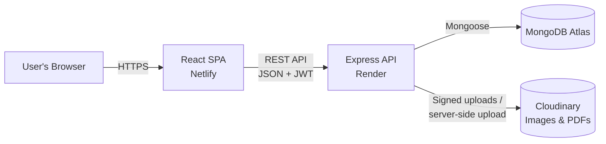

# TutionMaster

TutionMaster is a tutoring marketplace platform built for Nepal that connects students with qualified private tutors. Tutors register an account, build a detailed public profile (qualifications, subjects, availability, hourly rate, CV), and students can browse or search that directory without needing to create an account of their own.

## ✨ Features

### For Tutors
- **Account registration & login** with JWT-based authentication
- **Profile creation & management** — qualifications, address, preferred subjects, bio, years of experience, hourly rate, and weekly availability (day + time slots)
- **Avatar upload** — images are transformed (resized, converted to WebP, auto-quality) and hosted on Cloudinary
- **CV upload & viewing** — PDF CVs are stored on Cloudinary and rendered in-app with a zoomable, paginated, fullscreen-capable viewer
- **Dashboard** to view and manage an existing profile
- **Ownership enforcement** — only the tutor who owns a profile can update, delete, or replace its files

### For Students / Visitors
- **Public tutor directory** with server-side pagination
- **Filtering** by subject(s), city, teaching mode (Online / In-person / Both), experience range, and hourly rate range
- **Free-text search** across tutor name, bio, and city
- **Subject list endpoint** for populating subject filter options
- **Tutor detail pages** showing the full profile, including CV

### Platform-wide
- **Newsletter subscription** with duplicate-email detection
- **Responsive UI** built with Tailwind CSS
- **Centralized error handling** with consistent JSON error responses
- **Rate limiting** — a global limiter plus a stricter limiter on auth endpoints to slow down brute-force attempts

## 🛠️ Tech Stack

### Frontend

| Technology | Purpose |
| --- | --- |
| React 18 | UI library |
| React Router DOM 6 | Client-side routing |
| Axios | HTTP client, with auth-token and 401-redirect interceptors |
| React Hook Form | Form state and validation |
| React PDF | In-browser CV/PDF rendering |
| Tailwind CSS | Utility-first styling |
| Lucide React | Icon set |
| React Toastify | Toast notifications |

### Backend

| Technology | Purpose |
| --- | --- |
| Node.js / Express 4 | HTTP server and routing |
| MongoDB / Mongoose 7 | Database and ODM |
| JSON Web Tokens (jsonwebtoken) | Stateless authentication |
| bcryptjs | Password hashing |
| Cloudinary | Image and document (PDF) hosting |
| express-fileupload | Multipart file parsing for uploads |
| express-validator | Request body validation |
| Helmet, HPP, express-mongo-sanitize | Security headers, HTTP parameter pollution and NoSQL-injection protection |
| express-rate-limit | Global and auth-specific rate limiting |
| Winston + Morgan | Structured logging and HTTP request logging |
| PM2 | Production process management (clustering, restarts) |

### Deployment

| Technology | Purpose |
| --- | --- |
| Netlify | Frontend static hosting (`netlify.toml`) |
| Render | Backend web service hosting (`render.yaml`) |
| MongoDB Atlas | Managed database for production |
| Docker / Docker Compose | Local multi-container setup (Mongo + backend + frontend) |

## 🏗️ Project Architecture



The frontend is a single-page React application that talks to the backend exclusively over a JSON REST API. The backend authenticates requests with JWTs, persists tutor/user/newsletter data in MongoDB, and offloads all image and CV storage to Cloudinary (either via a direct server-side upload or a signed browser upload using a signature issued by the backend).

## 📁 Project Structure

```text
tutionmaster/
├── backend/
│   ├── config/
│   │   ├── cloudinary.js       # Cloudinary SDK configuration
│   │   └── database.js         # MongoDB connection with retry/backoff
│   ├── controllers/            # Route handler logic (auth, teachers, upload, newsletter)
│   ├── middleware/
│   │   ├── auth.js             # JWT verification (protect) + role check (authorize)
│   │   ├── error.js            # Centralized error handler
│   │   ├── rateLimiter.js      # Global + auth rate limiters
│   │   └── validation.js       # express-validator rule sets
│   ├── models/                 # Mongoose schemas: User, Teacher, Newsletter
│   ├── routes/                 # Express routers, mounted under /api
│   ├── services/               # Business logic (e.g. newsletter persistence)
│   ├── utils/                  # Logger, error class, env validation, retry helper
│   ├── ecosystem.config.js     # PM2 configuration for production
│   └── server.js               # Application entry point
│
├── frontend/
│   ├── public/                 # Static HTML shell and assets
│   ├── src/
│   │   ├── components/         # UI components grouped by feature/page
│   │   ├── context/            # AuthContext, TeacherContext (React Context API)
│   │   ├── hooks/               # Custom hooks (e.g. useCvViewer)
│   │   ├── pages/               # Route-level page components
│   │   ├── services/            # Axios-based API clients
│   │   ├── constants/            # Static data (e.g. Nepal states/cities)
│   │   └── App.js                # Route definitions
│   └── package.json
│
├── docker-compose.yml           # Local orchestration: MongoDB + backend + frontend
├── netlify.toml                 # Netlify build configuration (frontend)
├── render.yaml                  # Render Blueprint (backend)
└── README.md
```

## 🚀 Getting Started

### Prerequisites

- **Node.js** v20 or higher and **npm**
- A **MongoDB** instance — local, or a free [MongoDB Atlas](https://www.mongodb.com/atlas) cluster
- A **Cloudinary** account (for avatar and CV uploads)
- **Docker & Docker Compose** (optional, for the containerized setup)

### Installation

```bash
git clone https://github.com/AayushSinghRajput/tutionmaster.git
cd tutionmaster

# Backend
cd backend
npm install

# Frontend
cd ../frontend
npm install
```

### Environment Variables

Create `backend/.env`:

| Variable | Required | Description |
| --- | --- | --- |
| `MONGODB_URI` | Yes | MongoDB connection string |
| `JWT_SECRET` | Yes | Secret used to sign JWTs |
| `CLOUDINARY_CLOUD_NAME` | Yes | Cloudinary cloud name |
| `CLOUDINARY_API_KEY` | Yes | Cloudinary API key |
| `CLOUDINARY_API_SECRET` | Yes | Cloudinary API secret |
| `PORT` | No | Backend port (defaults to `8000`) |
| `JWT_EXPIRE` | No | JWT expiry duration (e.g. `30d`) |
| `CLIENT_URL` | No | Frontend origin allowed by CORS (defaults to `http://localhost:3000`) |
| `NODE_ENV` | No | `development` or `production` |

> The first five variables are enforced at startup — the server exits immediately if any are missing.

```env
MONGODB_URI=your_mongodb_connection_string
JWT_SECRET=your_jwt_secret_here
JWT_EXPIRE=30d
CLOUDINARY_CLOUD_NAME=your_cloudinary_cloud_name
CLOUDINARY_API_KEY=your_cloudinary_api_key
CLOUDINARY_API_SECRET=your_cloudinary_api_secret
PORT=8000
CLIENT_URL=http://localhost:3000
NODE_ENV=dev
```

Create `frontend/.env`:

| Variable | Required | Description |
| --- | --- | --- |
| `REACT_APP_API_URL` | Yes | Base URL of the backend API (e.g. `http://localhost:8000/api`) |
| `REACT_APP_CLOUDINARY_CLOUD_NAME` | Yes | Cloudinary cloud name used by the frontend |

```env
REACT_APP_API_URL=http://localhost:8000/api
REACT_APP_CLOUDINARY_CLOUD_NAME=your_cloudinary_cloud_name
```

### Running the Application

**Backend** (from `backend/`):

```bash
npm run dev     # development, via nodemon
npm start       # plain node
npm run start:prod   # production, via PM2 (uses ecosystem.config.js)
```

**Frontend** (from `frontend/`):

```bash
npm start       # development server on http://localhost:3000
npm run build   # production build, output to frontend/build
```

By default the backend listens on `http://localhost:8000` and the frontend on `http://localhost:3000`.

**Alternative: Docker Compose** (from the repository root):

```bash
docker-compose up
```

This starts MongoDB, the backend, and the frontend as three containers, using `backend/.env` and `frontend/.env` for configuration.

## 🔐 Authentication

- Authentication is JWT-based. `POST /api/auth/register` and `POST /api/auth/login` return a signed token and basic user info.
- The frontend stores the token in `localStorage` and attaches it to every request as `Authorization: Bearer <token>` via an Axios request interceptor ([frontend/src/services/api.js](frontend/src/services/api.js)).
- An Axios response interceptor clears the token and redirects to `/login` on any `401` response.
- On the backend, the `protect` middleware ([backend/middleware/auth.js](backend/middleware/auth.js)) verifies the JWT and loads the requesting user onto `req.user`; protected routes reject requests without a valid token.
- Every registered account currently has the role `teacher` (the `User` model's `role` field only allows this value today). Profile ownership is enforced separately — a tutor can only update or delete their own `Teacher` profile.

## 🔌 API Documentation

All endpoints are mounted under `/api`.

### Auth (`/api/auth`)

| Method | Endpoint | Description | Authentication |
| --- | --- | --- | --- |
| POST | `/api/auth/register` | Register a new tutor account | Public |
| POST | `/api/auth/login` | Log in and receive a JWT | Public |
| GET | `/api/auth/me` | Get the current authenticated user | Required |
| POST | `/api/auth/logout` | Log out (stateless — client discards token) | Required |

**Example — Register**

```http
POST /api/auth/register
Content-Type: application/json

{
  "username": "sarah",
  "email": "sarah@example.com",
  "password": "secret123",
  "confirmPassword": "secret123"
}
```

```json
{
  "success": true,
  "token": "<jwt>",
  "user": { "id": "...", "username": "sarah", "email": "sarah@example.com", "role": "teacher" }
}
```

### Tutors (`/api/teachers`)

| Method | Endpoint | Description | Authentication |
| --- | --- | --- | --- |
| GET | `/api/teachers` | List tutors with pagination and filters (`page`, `limit`, `subject`, `subjects`, `city`, `teachingMode`, `minExperience`, `maxExperience`, `minRate`, `maxRate`) | Public |
| GET | `/api/teachers/subject` | Get the distinct list of all subjects taught | Public |
| GET | `/api/teachers/search` | Free-text search (`q`, `subject`, `city`) | Public |
| GET | `/api/teachers/my-profile` | Get the logged-in user's own tutor profile | Required |
| GET | `/api/teachers/:id` | Get a single tutor profile | Public |
| POST | `/api/teachers` | Create a tutor profile (one per account) | Required |
| PUT | `/api/teachers/:id` | Update a tutor profile (owner only) | Required |
| DELETE | `/api/teachers/:id` | Delete a tutor profile and its Cloudinary files (owner only) | Required |

**Example — List with filters**

```http
GET /api/teachers?subject=Math&city=Kathmandu&minRate=500&maxRate=2000&page=1&limit=10
```

```json
{
  "success": true,
  "count": 10,
  "total": 42,
  "pagination": { "page": 1, "pages": 5 },
  "data": [ { "name": "...", "hourlyRate": 800, "avatarUrl": "...", "cvUrl": "..." } ]
}
```

### Uploads (`/api/upload`)

| Method | Endpoint | Description | Authentication |
| --- | --- | --- | --- |
| POST | `/api/upload/avatar` | Upload a profile avatar to Cloudinary | Required |
| POST | `/api/upload/cv` | Upload a CV (PDF) to Cloudinary | Required |
| DELETE | `/api/upload` | Delete a file by `publicId` (request body) | Required |
| POST | `/api/upload/signature` | Get a signed payload for a direct client-side Cloudinary upload | Required |

### Newsletter (`/api/newsletter`)

| Method | Endpoint | Description | Authentication |
| --- | --- | --- | --- |
| POST | `/api/newsletter/subscribe` | Subscribe an email address | Public |

### Health

| Method | Endpoint | Description | Authentication |
| --- | --- | --- | --- |
| GET | `/api/health` | Returns API status and a timestamp | Public |

## 🗄️ Database

MongoDB is accessed through Mongoose. There are three collections:

- **User** — `username`, `email` (unique), hashed `password`, `role` (currently only `teacher`). Passwords are hashed with bcrypt in a pre-save hook.
- **Teacher** — a tutor's public profile: `userId` (unique reference to `User`), `name`, `address` (street/city/state/zip), `qualifications[]`, `contact`, `preferredSubjects[]`, `bio`, `experience`, `availability[]` (day + time slots, validated so end time is after start time), `teachingMode`, `hourlyRate`, `isActive`, plus Cloudinary `avatarPublicId`/`cvPublicId`. Indexed on `address.city`, `preferredSubjects`, `teachingMode`, and `userId` to support filtering.
- **Newsletter** — subscribed `email` (unique) and `subscribedAt`.

Each `Teacher` document has a one-to-one relationship with a `User` document via `userId`.

## 🔄 Application Flow

**Tutor onboarding**
1. A tutor registers via `/register`, receiving a JWT stored in `localStorage`.
2. They visit `/create-profile` to submit their qualifications, subjects, availability, and rate, optionally uploading an avatar and CV.
3. The backend validates the payload (`express-validator`), persists it via Mongoose, and returns the created profile with generated Cloudinary URLs.

**Student discovery**
1. A visitor browses `/teachers`, which calls `GET /api/teachers` with any selected filters and the current page.
2. The backend builds a MongoDB filter from the query parameters, queries with pagination, and attaches Cloudinary URLs to each result.
3. Selecting a tutor navigates to `/teachers/:id`, which fetches the full profile, including an in-app CV viewer.

## 🧪 Testing

- The frontend is scaffolded with `react-scripts test` (Jest + React Testing Library), runnable via `npm test` from `frontend/`. Currently only the default Create React App boilerplate test ([frontend/src/App.test.js](frontend/src/App.test.js)) is present — there is no project-specific test suite yet.
- The backend has no test runner configured; `npm test` in `backend/` exits with an error placeholder.

## 📦 Build

```bash
cd frontend
npm run build
```

This produces an optimized static build in `frontend/build`, which is what both Netlify and the Docker frontend image serve.

## 🌐 Deployment

- **Frontend (Netlify)** — configured via the root [`netlify.toml`](netlify.toml): builds from the `frontend` directory (`npm run build`), publishes `frontend/build`, and includes a catch-all redirect to `index.html` to support client-side routing (React Router).
- **Backend (Render)** — configured via [`render.yaml`](render.yaml) as a Render Blueprint: runs from `backend`, installs with `npm install`, starts with `npm start`, and health-checks `/api/health`. Required secrets (`MONGODB_URI`, `CLOUDINARY_*`, `CLIENT_URL`) are entered in the Render dashboard when the blueprint is deployed.
- **Database** — Render does not provide managed MongoDB, so production deployments should point `MONGODB_URI` at a MongoDB Atlas cluster.
- **Local containers** — `docker-compose.yml` at the repository root runs MongoDB, the backend, and the frontend together for local development.

## 🔒 Security

- Passwords hashed with bcrypt (`bcryptjs`) before storage.
- Stateless authentication via JWTs, verified on every protected route.
- Required environment variables are validated at startup ([backend/utils/validateEnv.js](backend/utils/validateEnv.js)) — the process exits if secrets are missing, preventing an insecurely-configured server from running.
- `helmet` sets protective HTTP headers; `hpp` guards against HTTP parameter pollution; `express-mongo-sanitize` strips Mongo operators from user input to block NoSQL injection.
- CORS is restricted to a single configured origin (`CLIENT_URL`) rather than left open.
- Global rate limiting (300 requests / 15 min per IP) and a stricter limiter on auth routes (10 attempts / 15 min, successful requests excluded) to reduce brute-force risk.
- Request bodies are capped at 2MB; uploaded files are capped at 5MB.
- All request input to auth and profile-creation endpoints is validated with `express-validator` before hitting the database.
- `.env` files are excluded from version control in both `backend/.gitignore` and `frontend/.gitignore`.

## ⚡ Performance

- Gzip response compression (`compression` middleware).
- Server-side pagination on the tutor listing endpoint instead of returning the full collection.
- MongoDB indexes on the fields most commonly filtered (`address.city`, `preferredSubjects`, `teachingMode`, `userId`).
- Avatar images are transformed and compressed by Cloudinary on upload (resized, converted to WebP, `quality: auto`) rather than served at original size/format.
- Cloudinary operations (uploads, deletions) are wrapped with a retry helper ([backend/utils/withRetry.js](backend/utils/withRetry.js)) to absorb transient failures.

## 🐛 Troubleshooting

### Backend exits immediately with "Missing required environment variable(s)"
One of `MONGODB_URI`, `JWT_SECRET`, `CLOUDINARY_CLOUD_NAME`, `CLOUDINARY_API_KEY`, or `CLOUDINARY_API_SECRET` is not set in `backend/.env`. The server validates these on startup and exits on purpose rather than running misconfigured.

### Frontend requests fail with a CORS error in the browser console
The backend's `CLIENT_URL` must exactly match the origin the frontend is served from (protocol + host, e.g. `http://localhost:3000` or your Netlify URL). CORS is restricted to this single origin in `server.js`.

### MongoDB connection fails on startup
`connectDB` retries up to 5 times with exponential backoff before exiting. Double-check `MONGODB_URI` and, if using Atlas, that your current IP (or `0.0.0.0/0` for hosted deployments) is allowed under Network Access.

### 401 Unauthorized on routes that should be accessible
Confirm a token exists in `localStorage` and is being sent — the Axios instance in `frontend/src/services/api.js` attaches it automatically, but an expired or missing token will redirect to `/login`.

### File upload rejected
`express-fileupload` is configured with a 5MB limit in `server.js`; anything larger will be rejected before it reaches Cloudinary.

## 🤝 Contributing

1. Fork the repository
2. Create a feature branch (`git checkout -b feature/your-feature`)
3. Make your changes
4. Test your changes
5. Commit your changes (`git commit -m 'Add your feature'`)
6. Push the branch (`git push origin feature/your-feature`)
7. Open a pull request

## 📄 License

No license has been specified for this project yet.

## 👨‍💻 Author

**Aayush Singh Rajput** — [GitHub](https://github.com/AayushSinghRajput)
